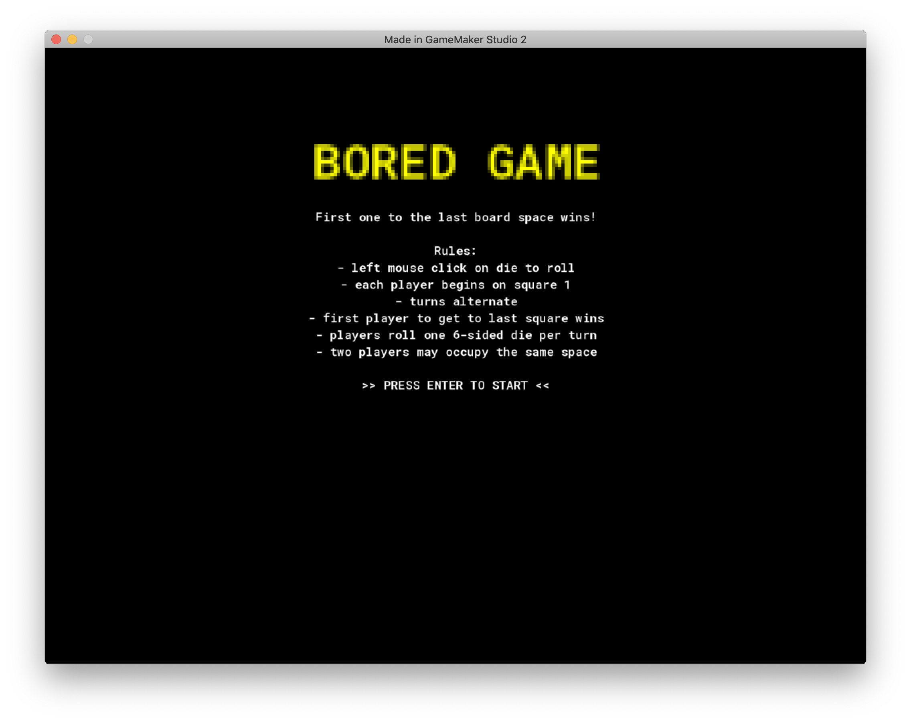
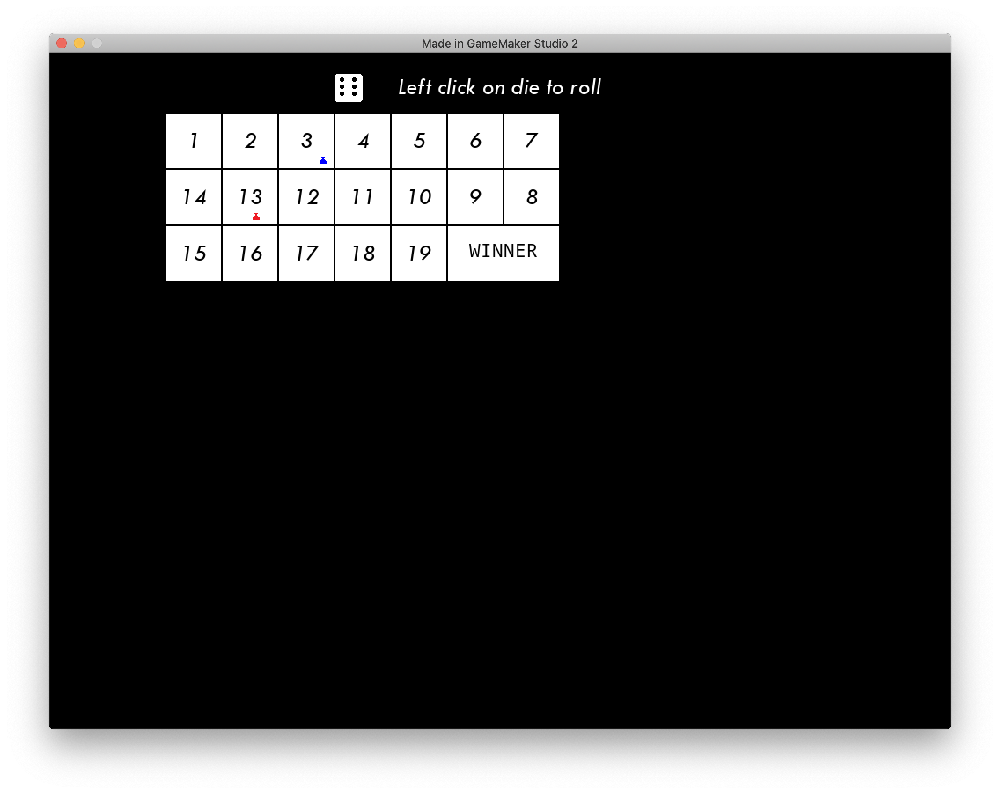

Bored Game: Two player game with each rolling a 6 sided die to see who can get to the end of the board first. For the rules, see the main screen.

Tis but a boring, board game. It was used to work on game mechanics in GameMaker.

This game was inspired by [https://www.udemy.com/boardgames/learn/v4]()

Sample screenshots: 

